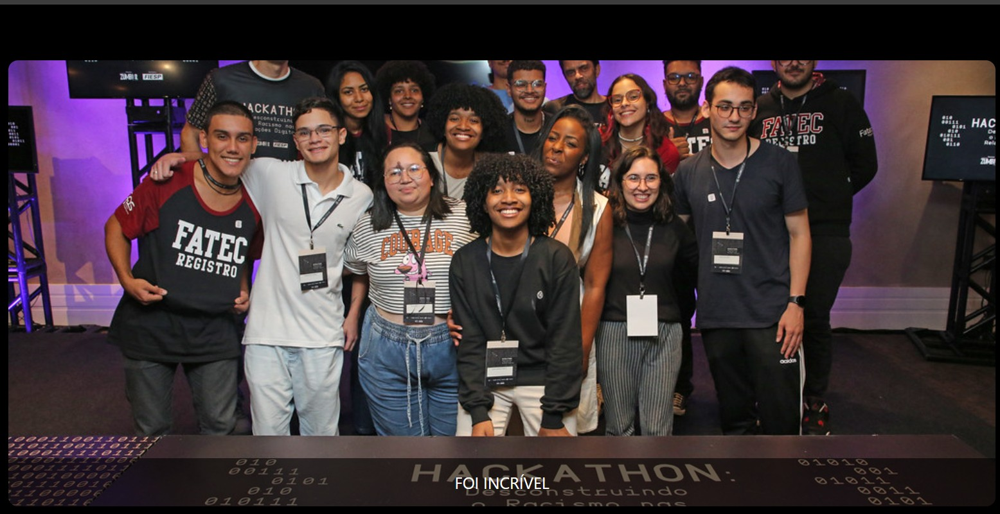

# Landing Page Dinâmica

---

## Sobre

Este projeto implementa um carrossel de imagens com efeito de fade-in e fade-out utilizando Tailwind para estilização e JavaScript para controlar a lógica de transição.
O objetivo foi reproduzir a ideia de um slide animado (sem depender de keyframes do CSS) apenas com utilitários do Tailwind e manipulação de classes via JS.

---

## Tecnologias Utilizadas

- HTML
- Tailwind
- JavaScript
- Markdown

---

## Autora

-[Aline Alves de Souza](https://github.com/AlineMaker)
